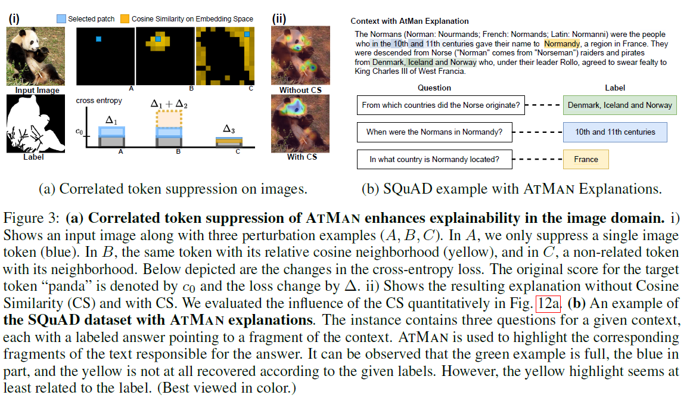
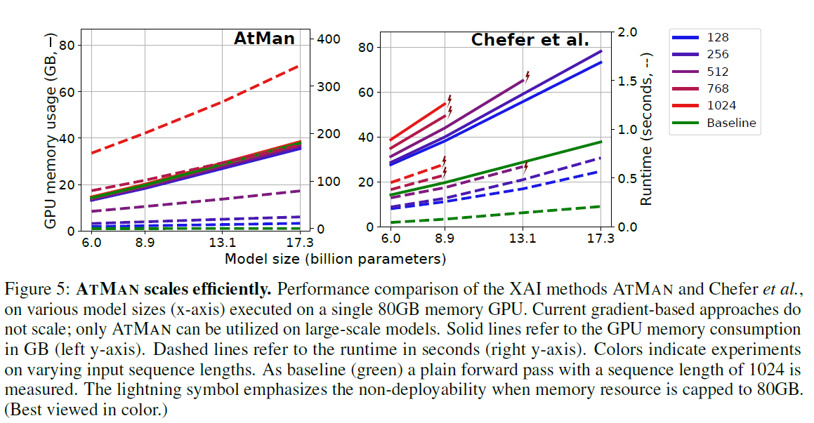

# AtMan- XAI on generative models

AtMan is an explainability method designed for multi-modal generative transformer models. It correlates the relevance of the input tokens to the generated output by exhaustive perturbation. To obtain the score values, it applies ATtention MANipulation throughout all layers, and measures the difference in the resulting logprobs on the target tokens.
It further encorporates embedding similarity to surppress the entire entropy found at once.
As depicted in following examples, one is able to highlight various discriminative features on the same input, i.p. on text as well as image-modality.


[Paper Link](https://arxiv.org/abs/2301.08110)

## roadmap
 - continue to cleanup repo
 - i.p. remove Explainer class and other overhead
 - more examples
 - hf integration?

## prelim
This repo includes the XAI methods AtMan, Chefer, and a Captum interface for IG, GradCam etc. for the language-model GPT-J and vision-language model [MAGMA](https://github.com/Aleph-Alpha/magma) and [BLIP](https://colab.research.google.com/github/salesforce/BLIP). (Big props to Mayukh Deb.)

To install all required dependencies, run the following command, e.g. in a conda environment with python3.8:
```
bash startup-hook.sh
```
Note: further model-checkpoints will be downloaded when executing for the first time. Sometimes CLIP fails to verify on the first execution -> running again works usually.

# examples with MAGMA
```
cd atman-magma
```
## image-text/ MAGMA x AtMan
requires 1 RTX 3090

```
python example_explain_panda_atman.py
```

## image-text/ MAGMA x Chefer
requires 1 A100

```
python example_explain_panda_chefer.py
run plot_panda.ipynb
```

## image-text/ MAGMA x Captum IxG, ...
requires 1 A100

```
python example_explain_panda_captum.py
run plot_panda.ipynb
```

## image-text/ rollout
on it

## image-text/ BLIP
on it

## text/ GPT-J
on it


# Method and Evaluation








